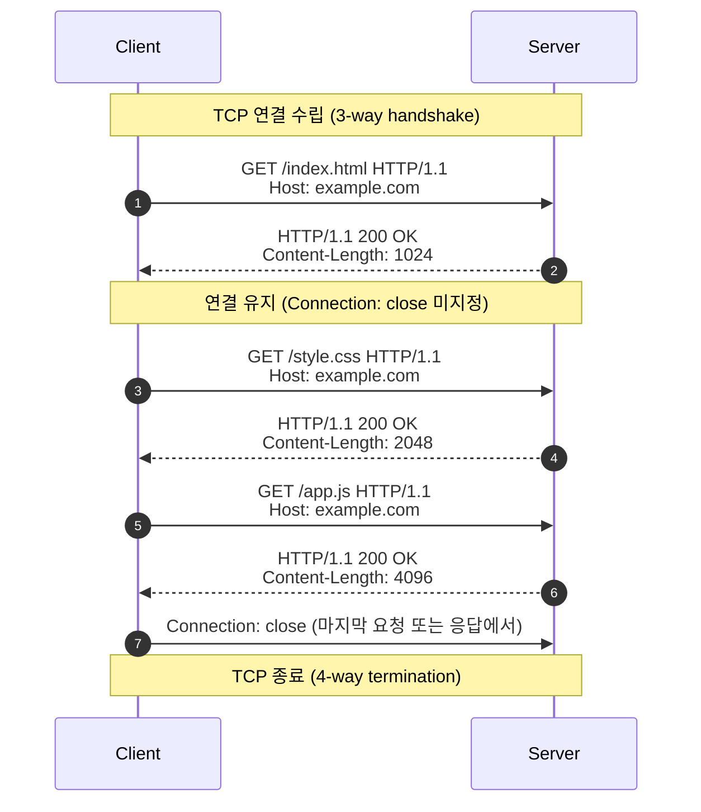

# HTTP Keep-Alive (Persistent Connection)

## Summary

HTTP Keep-Alive는 클라이언트와 서버 간의 **TCP 연결을 한 번 맺은 뒤 여러 요청·응답에 재사용**할 수 있도록 하는 기능이다. 이를 통해 연결 생성/종료의 오버헤드를 줄이고, 웹 페이지 로딩 속도를 개선한다.

## Details

### 배경

* **HTTP/1.0**: 기본적으로 요청마다 TCP 연결을 새로 생성.

  * 문제: 3-way handshake(연결 수립) + 4-way termination(연결 종료) → 오버헤드 증가.
  * 하나의 웹 페이지에 포함된 다수의 이미지·스크립트·스타일시트 요청 시, 지연 심각.

### HTTP/1.0의 Keep-Alive (비표준 확장)

* 일부 서버와 브라우저는 **비공식적으로** `Connection: keep-alive` 헤더를 사용.
* 동작: 요청 후 연결을 일정 시간 유지, 추가 요청에 재사용.
* 하지만 표준화 부족 → 상호 운용성 문제 발생.

### HTTP/1.1의 Persistent Connection (기본값)

* **RFC 2068 (1997)** 에서 Keep-Alive가 공식 기능으로 포함됨.
* 기본적으로 연결을 재사용하도록 정의 → 명시적으로 `Connection: close`를 보내야 종료.

**예시**:

```
GET /index.html HTTP/1.1
Host: www.example.com

HTTP/1.1 200 OK
Content-Length: 1024
Content-Type: text/html
```



* 연결 종료 명시가 없으면 TCP 연결은 계속 열려 있음.
* 이후 동일 연결로 `/style.css`, `/script.js` 요청 가능.


### 장점

1. **성능 향상**: 연결 재사용으로 handshake/teardown 비용 절감.
2. **페이지 로딩 속도 개선**: 다수의 리소스를 빠르게 불러옴.
3. **네트워크 효율성**: TCP 혼잡 제어(Congestion Control) 효과적으로 동작.

### 한계

* **Head-of-Line Blocking**: 한 요청이 지연되면 같은 연결 내 다른 요청도 지연.
* **자원 점유 문제**: 연결을 오래 유지하면 서버 리소스 사용량 증가.
* → 이 문제를 해결하기 위해 HTTP/2에서 멀티플렉싱이 도입됨.

## Reference

**link:** External reference

* [RFC 2068 - Hypertext Transfer Protocol -- HTTP/1.1 (Persistent Connections)](https://datatracker.ietf.org/doc/html/rfc2068#section-19.7.1)
* [MDN - Connection header](https://developer.mozilla.org/en-US/docs/Web/HTTP/Headers/Connection)
