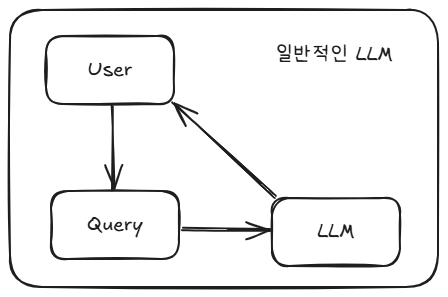
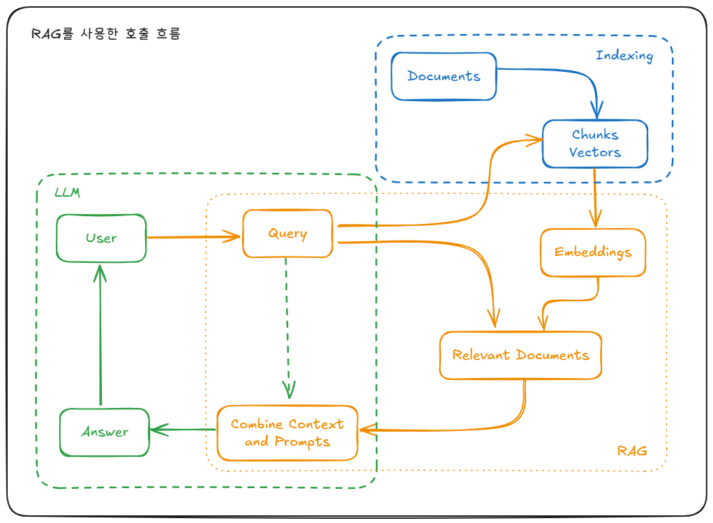

# RAG

## Summary
RAG(Retrieval-Augmented Generation)는 외부에서 검색된 정보를 기반으로 **질의(Query)의 컨텍스트를 강화한 뒤**, LLM이 그 강화된 입력을 바탕으로 답변을 생성하도록 하는 구조적 기술이다.
RAG는 흔히 LLM의 생성 능력을 보완하는 기술로 오해되지만, 본질적으로는 **LLM 이전 단계에서 작동하며, LLM의 입력 품질을 높이는 ‘컨텍스트 강화(Augmented Context)’ 기술**이라고 이해해야 한다.
Embedding → Vector Search → Context Build → Generation의 흐름으로 구성되며, LLM은 마지막 단계에서만 사용된다.

## Details

### RAG의 기본 개념
RAG는 Retrieval(검색)과 Augmentation(강화), Generation(생성)을 결합한 아키텍처이다.
그러나 실제로 중요한 것은 **검색한 정보를 기반으로 “컨텍스트를 보강한 질의”를 만든다는 점**이다.

- R: Retrieval → 필요한 정보를 외부에서 *끌어오는 것*
- A: Augmented → “향상된·강화된” 정도의 의미
- G: Generation → 모델의 생성 단계이지만, 여기서는 사실상 마케팅 용어에 가깝다

따라서 RAG는 **정보 추출 + 문맥 강화 + 생성**의 세 단계를 가진 파이프라인이다.

### RAG의 핵심 구성 요소: Embedding → Vector Search → Context 강화

**[1. Embedding]**
- 텍스트를 **고정된 차원의 숫자 벡터**로 변환하는 과정이다.
- “숫자로 바꾼다”가 아니라
**정해진 차원의 숫자 집합으로 표현한다는 점이 핵심**이다.
- Embedding은 LLM과 독립적으로 동작할 수 있다.

**[2. Vector Similarity Search]**
- Embedding된 벡터를 기준으로 벡터스토어에서 **가장 유사한 벡터**를 검색한다.
- 검색된 벡터는 원본 문서 조각과 연결되어 있으며, 이것이 R(Retrieval)의 본질이다.

**[3. Augmented Context (문맥 강화)]**
- 검색된 문서를 기반으로 **Query의 컨텍스트를 보강**한다.
- 오해를 풀어야 할 점:
RAG는 LLM의 “생성(Generation)”을 강화하는 게 아니라
**LLM에 전달되는 Query(입력)를 강화하는 기술**이다.
- 더 정확히는 RAG보다는 **RAC(Retrieval-Augmented Context)**라는 표현이 개념적으로 맞다.

### RAG는 LLM 기술이 아니다
영상의 핵심 메시지 중 하나는 다음과 같다:

> **“RAG의 대부분 과정은 LLM 없이 작동한다.”**

실제 구조:
1. Embedding
2. Vector DB 검색
3. Context Build
4. **LLM 호출은 가장 마지막 단계**

즉:
- Embedding도 LLM 없이 가능하고,
- Vector Search도 LLM 없이 가능하며,
- 컨텍스트 결합도 LLM과 무관한 로직이다.

LLM은 단지 **강화된 Query를 받아 생성하는 마지막 도구**일 뿐이다.

### 일반적인 LLM 호출 vs RAG 호출 흐름 비교

**[✔ 기본 LLM 사용]**
1. Query 입력
2. LLM.invoke()
3. 결과 출력

**[✔ RAG 사용]**

1. Query 입력
2. Embedding 생성
3. Vector DB 검색
4. 문서 취합
5. Query + 문서 → 새로운 강화 Query 생성
6. **이 강화된 Query를 LLM에 전달**

즉,
**RAG는 LLM 호출을 위한 입력을 준비하는 거대한 전처리 파이프라인**이다.

### RAG의 장점
1. **정확성 향상**
 근거 기반 생성으로 hallucination 감소.
2. **지식 업데이트 용이**
 벡터DB만 변경하면 모델 재학습 없이 최신 지식 반영.
3. **도메인 특화 가능**
 내부 문서, 논문, API 등 특정 지식에 최적화.
4. **비용 효율성**
 fine-tuning 대비 훨씬 경제적.

### RAG의 단점
1. **검색 품질에 따라 결과가 좌우**
2. **Chunking 품질이 성능 전체를 결정**
3. **문서 소스가 비정형이면 난이도 증가**
4. **검색 파이프라인 때문에 지연 시간이 생길 수 있음**

### 고급 RAG 기법(Advanced RAG)
- HyDE (가상 문서 생성 후 검색)
- Multi-vector RAG (문서당 다중 임베딩)
- Query Transformation (질의 분해)
- Reranking (정확도 향상)
- Graph RAG(지식 그래프 기반 검색)

## Reference

- [Video: Understanding RAG – Why RAG Is NOT About LLM](https://www.youtube.com/watch?v=E-vR6a_JW5o&list=PLBNdLLaRx_rIOonq7AvNnjrYNVQqNsOY0&index=8)
- [What is RAG? - V7 Labs](https://www.v7labs.com/blog/what-is-rag)
- [RAG Zero to Hero Guide – What is RAG?](https://github.com/KalyanKS-NLP/rag-zero-to-hero-guide/blob/main/RAG%20Basics/What_is_RAG.md)
