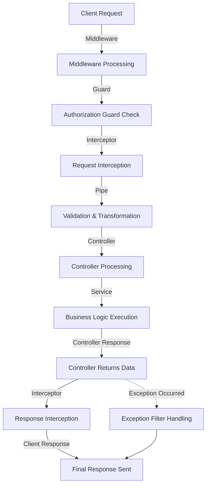

# NestJS Request Lifecycle

## Summary

NestJS의 요청 수명 주기는 요청이 서버로 들어와 처리된 후 응답이 반환될 때까지의 흐름을 나타낸다. 이 과정은 여러 핵심 구성 요소(미들웨어, 가드, 인터셉터, 파이프, 컨트롤러, 서비스, 예외 필터)를 거치며 요청과 응답을 조작할 수 있다.

## Details

### 요청 수명 주기의 주요 단계

1. **미들웨어 (Middleware)**
   - 요청이 컨트롤러에 도달하기 전에 실행됨
   - 로깅, 인증, 요청 변환 등의 작업 수행
   - `next()` 호출을 통해 다음 단계로 전달

   ```typescript
   @Injectable()
   export class LoggerMiddleware implements NestMiddleware {
     use(req: Request, res: Response, next: NextFunction) {
       console.log(`[${new Date().toISOString()}] ${req.method} ${req.url}`);
       next();
     }
   }
   ```

2. **가드 (Guard)**
   - 요청이 특정 라우트에 접근할 수 있는지 여부를 결정
   - 주로 인증 및 권한 검증에 사용됨

   ```typescript
   @Injectable()
   export class AuthGuard implements CanActivate {
     canActivate(context: ExecutionContext): boolean {
       const request = context.switchToHttp().getRequest();
       return validateRequest(request);
     }
   }
   ```

3. **인터셉터 (Interceptor)**
   - 요청 및 응답을 변환하거나 로깅, 메타데이터 추가 등의 작업 수행
   - 메서드 실행 전후 로직을 추가할 수 있음

   ```typescript
   @Injectable()
   export class TransformInterceptor implements NestInterceptor {
     intercept(context: ExecutionContext, next: CallHandler): Observable<any> {
       return next.handle().pipe(map((data) => ({data})));
     }
   }
   ```

4. **파이프 (Pipe)**
   - 요청 데이터의 유효성을 검사하거나 변환을 수행

   ```typescript
   @Injectable()
   export class ValidationPipe implements PipeTransform {
     transform(value: any, metadata: ArgumentMetadata) {
       if (!value) {
         throw new BadRequestException('Validation failed');
       }
       return value;
     }
   }
   ```

5. **컨트롤러 (Controller)**
   - 클라이언트의 요청을 처리하고 응답을 생성하는 역할

   ```typescript
   @Controller('cats')
   export class CatsController {
     @Get()
     findAll(): string {
       return 'This action returns all cats';
     }
   }
   ```

6. **서비스 (Service)**
   - 비즈니스 로직을 처리하며 데이터베이스 및 외부 API와 상호작용

   ```typescript
   @Injectable()
   export class CatsService {
     private readonly cats: Cat[] = [];

     findAll(): Cat[] {
       return this.cats;
     }
   }
   ```

7. **예외 필터 (Exception Filter)**
   - 애플리케이션 내에서 발생한 예외를 처리

   ```typescript
   @Catch(HttpException)
   export class HttpExceptionFilter implements ExceptionFilter {
     catch(exception: HttpException, host: ArgumentsHost) {
       const ctx = host.switchToHttp();
       const response = ctx.getResponse();
       const status = exception.getStatus();

       response.status(status).json({
         statusCode: status,
         timestamp: new Date().toISOString(),
         path: request.url,
       });
     }
   }
   ```

### 요청 수명 주기 다이어그램



## Reference

**link:** External reference

- [NestJS 공식 문서 - Request Lifecycle](https://docs.nestjs.com/faq/request-lifecycle)
