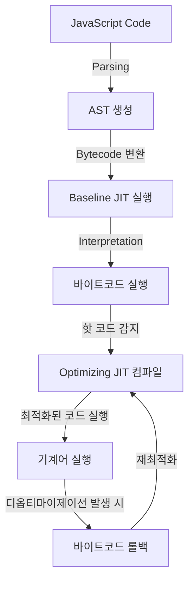

# JavaScript Compilation Process

## Summary
JavaScript의 컴파일 과정은 다른 정적 컴파일 언어(C, Java)와 다르게 **Just-In-Time(JIT) 컴파일러**를 활용하는 방식으로 진행된다. 실행 중에 코드를 변환하고 최적화하는 과정을 거쳐 높은 성능을 유지한다.

## Details

### 1. JavaScript 코드 실행 과정 개요
JavaScript는 일반적인 정적 컴파일 방식이 아닌 **인터프리터 + JIT 컴파일러** 방식을 사용한다. 실행 과정은 다음과 같이 진행된다:
1. **Parsing (구문 분석)**: JavaScript 코드를 읽고 AST(Abstract Syntax Tree)을 생성한다.
2. **Compilation (컴파일)**: AST를 바탕으로 바이트코드(Bytecode)로 변환된다.
3. **Execution (실행)**: 바이트코드를 실행하면서 JIT(Just-In-Time) 컴파일러가 최적화를 수행한다.
4. **Optimization (최적화)**: 자주 실행되는 코드(핫 코드)를 감지하여 최적화된 기계어로 변환한다.
5. **Deoptimization (최적화 해제)**: 예기치 않은 코드 실행 패턴이 발생하면 최적화된 코드를 폐기하고 다시 인터프리터 방식으로 실행한다.

### 2. 주요 단계 설명

#### **1) Parsing (구문 분석)**
- 소스 코드를 토큰(Token) 단위로 분석하여 **AST(Abstract Syntax Tree, 추상 구문 트리)**를 생성한다.
- AST는 이후의 컴파일 및 실행 과정을 위한 중간 표현이다.

#### **2) Bytecode 변환 (Baseline JIT 컴파일)**
- AST를 기반으로 바이트코드(Bytecode)를 생성하여 실행 준비를 한다.
- 바이트코드는 인터프리터 방식으로 실행되지만, 이후 JIT 컴파일러에 의해 최적화된다.

#### **3) Execution (실행)**
- 바이트코드를 실행하면서 JIT 컴파일러가 자주 실행되는 코드(핫 코드)를 감지한다.
- **핫 코드 감지**: 특정 함수나 루프가 반복 실행될 경우 이를 최적화 대상으로 인식한다.

#### **4) Optimization (최적화 수행)**
- JIT 컴파일러가 핫 코드(Hot Code)를 **기계어(Machine Code)**로 변환하여 실행 속도를 향상시킨다.
- **대표적인 최적화 기법**: 인라인 캐싱(Inline Caching), 코드 인라이닝(Code Inlining) 등

#### **5) Deoptimization (디옵티마이제이션, 최적화 해제)**
- 실행 중 예상과 다른 코드 패턴이 감지되면 최적화된 코드를 버리고 바이트코드 실행 방식으로 롤백한다.
- 예를 들어, 변수의 타입이 동적으로 변경되거나 예외적인 실행 흐름이 발생하면 디옵티마이제이션이 일어난다.

## Reference

**issue:** Related issue in this repo
- [JavaScript Engine은 어떻게 동작하는가?](https://github.com/luke0408/TIL/issues/1)

**author note:** Related note in this repo
- [JavaScript Engine Intro](./Introduction_to_JavaScript_Engine.md)
- [JavaScript Parser and AST](./Parser_And_AST.md)
- [Execution Context in JavaScript](./Execution_Context.md)

**link:** External reference
- [How JavaScript Really Works?](https://dev.to/laxminarayana31/how-javascript-really-works-1p6i)
- [How Does JavaScript Work Behind the Scenes? JS Engine and Runtime Explained](https://www.freecodecamp.org/news/how-javascript-works-behind-the-scenes/)
- [Introduction to Javascript Engines](https://www.geeksforgeeks.org/introduction-to-javascript-engines/)
- [JavaScript Engine and Runtime Explained](https://www.freecodecamp.org/news/javascript-engine-and-runtime-explained/)

